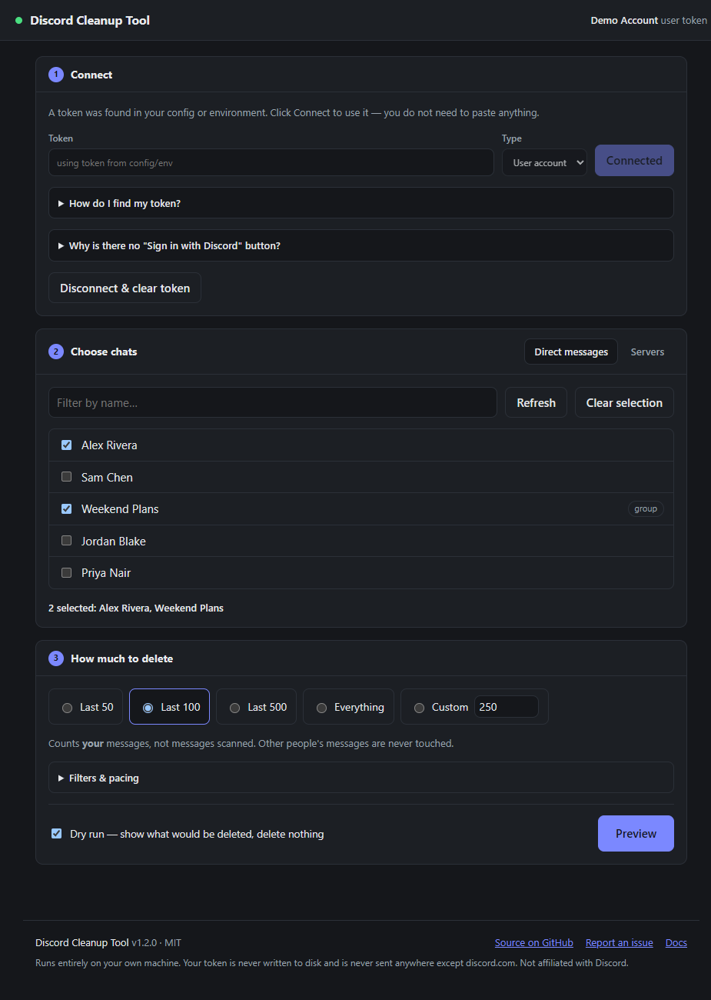
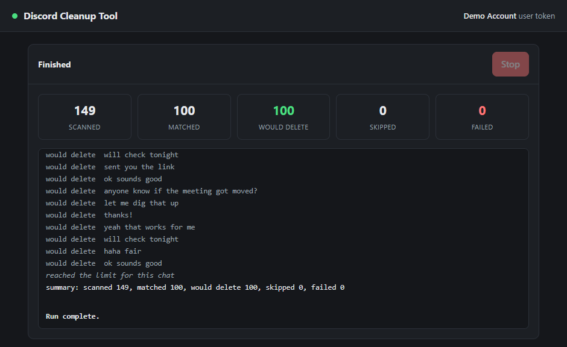

<div align="center">

# Discord Cleanup Tool

**Bulk-delete your own Discord messages — from DMs, group DMs and server channels — at a pace that stays under Discord's rate limits.**

Browser dashboard *or* CLI. Runs entirely on your machine. Zero dependencies.

[](https://github.com/SurefireStudios/DiscordCleanupTool/actions/workflows/ci.yml)
[](LICENSE)
[](https://nodejs.org)
[](package.json)
[](test)
[](https://github.com/SurefireStudios/DiscordCleanupTool)



</div>

---

> [!CAUTION]
> **Deleting Discord messages is permanent.** There is no undo, no trash and no export-first
> step. In a DM, deletion is two-sided — the messages disappear from the other person's client
> too. Always do a dry run first. The dashboard defaults to dry run; the CLI takes `--dry-run`.

> [!WARNING]
> **Cleaning your own DMs requires a user token, and automating a user account violates
> Discord's Terms of Service** and can get the account terminated. Discord provides no
> supported route for this. A **bot token** is fully supported but can only delete messages the
> bot itself sent. [See the comparison below](#which-token-do-i-need) and decide for yourself.

---

## Features

- 🗂 **Pick exactly which chats to clean** — DMs, group DMs and server channels, by checkbox in the dashboard or by ID / named alias on the CLI.
- 🔢 **Choose how much** — last 50 / 100 / 500, a custom number, or everything.
- 🧪 **Dry run by default** — see precisely what would go before anything does.
- 🐢 **Rate-limit aware** — fixed delay, periodic longer pause, and header-driven backoff that waits out an exhausted bucket *before* sending, instead of eating a 429.
- 🔍 **Filters** — only messages containing given text, only older than a date, only newer than a date.
- ⏹ **Stop mid-run** — halts after the current message, with the tally intact.
- 🛡 **Never touches anyone else's messages** — every candidate is filtered against your own user ID.
- 🔒 **Token never leaves your machine** — held in memory only, never written to disk, never sent anywhere but `discord.com`.
- 📦 **No dependencies, no build step** — Node 18+ and the built-in `fetch`.

## Screenshots

| Dashboard | Live run |
| --- | --- |
|  |  |

## Tech stack

| | |
| --- | --- |
| **Runtime** | Node.js ≥ 18 (ES modules, native `fetch`) |
| **Backend** | `node:http` — no framework |
| **Frontend** | Vanilla HTML / CSS / JS, no build step, no bundler |
| **Transport** | Discord REST API v10, Server-Sent Events for live progress |
| **Tests** | `node:assert` against a stubbed API — no network, no real deletions |
| **Dependencies** | None |

---

## Requirements

- **Node.js 18 or newer** (`node --version`) — needed for the built-in `fetch`.
- A Discord token — see [Getting a token](#getting-a-token).

## Installation

```bash
git clone https://github.com/SurefireStudios/DiscordCleanupTool.git
cd DiscordCleanupTool
```

There is nothing to build and nothing to install — no `npm install` step, because there are no
dependencies.

Optionally create a config file for defaults and channel aliases:

```bash
cp config.example.json config.json
```

> [!TIP]
> Prefer the `DISCORD_TOKEN` environment variable over putting your token in `config.json`, so
> it never lands on disk. `config.json` is gitignored either way.

```bash
export DISCORD_TOKEN="your-token-here"      # bash / zsh / git bash
```

```powershell
$env:DISCORD_TOKEN = "your-token-here"      # PowerShell
```

Verify it works:

```bash
node src/cli.js whoami
```

If that prints your account name, you're ready.

---

## Usage

Two interfaces, one engine — behaviour and pacing are identical.

### Dashboard (recommended)

```bash
npm run dashboard
```

Opens **http://127.0.0.1:8787** and walks you through three steps:

1. **Connect** — paste a token, or click Connect if `DISCORD_TOKEN` is already set. A built-in
   *How do I find my token?* panel walks through the steps, and switches to Developer Portal
   instructions when you set Type to Bot. Pasted tokens get an instant local format check —
   wrong shape, stray whitespace, a leftover `Bot ` prefix — before anything is sent anywhere.
2. **Choose chats** — your DMs and group DMs appear as a checkbox list with a filter box, plus a
   Servers tab for guild channels.
3. **How much to delete** — Last 50 / 100 / 500 / Everything / custom, with filters and pacing
   under *Filters & pacing*.

Dry run is on by default and the button reads **Preview**. Turning it off switches the button to
a red **Delete** and adds a confirmation dialog listing exactly what is about to happen; choosing
*Everything* additionally requires typing `DELETE`. During a run you get live counters, a
streaming log and a **Stop** button.

Options:

```bash
npm run dashboard -- --port 9000 --no-open
```

### CLI

```bash
node src/cli.js help
```

**Find the chats you want:**

```bash
node src/cli.js list dms                 # open DMs and group DMs, with their channel IDs
node src/cli.js list guilds              # servers
node src/cli.js list channels <guildId>  # text channels in one server
```

> [!NOTE]
> `list dms` only shows conversations currently **open** in your Discord client. If a DM is
> missing, open it in Discord and run the command again.

**Clean them:**

```bash
# always start here
node src/cli.js clean <channelId> --limit 50 --dry-run

# the real thing
node src/cli.js clean <channelId> --limit 50
node src/cli.js clean <channelId> --limit all

# several at once
node src/cli.js clean alex-dm team-general --limit 100

# narrower sweeps
node src/cli.js clean team-general --contains "wrong link" --limit all
node src/cli.js clean alex-dm --before 2025-06-01 --limit all
```

`--limit` counts **your** messages, not messages scanned — `--limit 50` means "delete 50 of
mine", however much history it has to read to find them. Without `--yes`, a real run prints what
it is about to do and waits for you to type `yes`.

<details>
<summary><strong>Full CLI reference</strong></summary>

```
Usage
  ddel whoami                        Verify the token and show the account it belongs to
  ddel list dms                      List open DMs / group DMs with their channel IDs
  ddel list guilds                   List servers the account is in
  ddel list channels <guildId>       List text channels in a server
  ddel targets                       Show the aliases defined in config.json
  ddel clean <target...> [options]   Delete your messages in one or more channels

Targets
  A target is a channel ID (17-20 digits) or an alias from "targets" in config.json.
  Pass several to clean them in sequence.

Clean options
  --limit <n|all>     How many of your messages to delete per channel. Default: 50
  --scan-limit <n>    Stop after reading this many messages while searching. Default: unlimited
  --contains <text>   Only delete messages containing this text (case-insensitive)
  --before <date>     Only delete messages older than this (e.g. 2026-01-01)
  --after <date>      Only delete messages newer than this
  --delay <ms>        Pause between deletes. Default: from config (1200)
  --pause-every <n>   Take a longer breather every n deletes. Default: 50
  --pause <ms>        Length of that breather. Default: 5000
  --bulk              Use bulk-delete for messages under 14 days old (bot tokens, servers only)
  --dry-run           Report what would be deleted without deleting anything
  --yes               Skip the confirmation prompt
  --json              Emit a machine-readable summary at the end
```

Invoke as `node src/cli.js <command>`, or link the `ddel` bin with `npm link`.

</details>

---

## Configuration

`config.json` is optional — everything has a default, and the token can come from the
environment. Copy `config.example.json` to get started.

| Key | Default | What it does |
| --- | --- | --- |
| `token` | – | Your token. Prefer `DISCORD_TOKEN` in the environment instead. |
| `tokenType` | `"user"` | `"user"` or `"bot"`. Controls the auth header and User-Agent. |
| `delayMs` | `1200` | Milliseconds between individual deletes. |
| `pauseEvery` | `50` | Take a longer pause after this many deletes. |
| `pauseMs` | `5000` | How long that pause lasts. |
| `userAgent` | per token type | Override the User-Agent header. |
| `targets` | `{}` | Named aliases for channel IDs, so you can type a name instead of an ID. |

```json
{
  "tokenType": "user",
  "delayMs": 1200,
  "targets": {
    "alex-dm": "123456789012345678",
    "team-general": "987654321098765432"
  }
}
```

`node src/cli.js targets` lists your aliases back. `DISCORD_TOKEN` and `DISCORD_TOKEN_TYPE`
always override the file.

---

## Getting a token

### Which token do I need?

| | Bot token | User token (your own account) |
| --- | --- | --- |
| Where it comes from | Discord Developer Portal | your own logged-in session |
| Can delete | only messages the **bot** sent | messages **you** sent |
| Works in your private DMs | ❌ a bot can't see your DMs with other people | ✅ |
| Discord's rules | ✅ supported and intended | ⚠️ **against the Terms of Service** |

If you want to clean your own DMs, a user token is the only thing that does it. That is a ToS
violation Discord does not carve out an exception for, and the account risk is real. This tool
supports both and does not choose for you.

### User token

Do this in a **web browser**, not the desktop app (the app ships with DevTools disabled).

1. Open <https://discord.com/app> and log in.
2. Press <kbd>F12</kbd> to open DevTools, then go to the **Network** tab.
3. Type `api` in the filter box.
4. Click around — open a DM, switch channels — so requests appear.
5. Click any request to `discord.com/api/v10/…`.
6. Under **Request Headers**, find `authorization:`. That value is your token.

> [!CAUTION]
> **That string is your account.** Anyone holding it is logged in as you — no password, no 2FA.
> Never paste it into a website, a bot, a "token checker", or a script someone hands you.
> Talking people into doing exactly that is the standard Discord account-theft scam. Changing
> your Discord password invalidates the token instantly, which is your kill switch if it leaks.

### Bot token

1. Open the [Discord Developer Portal](https://discord.com/developers/applications).
2. **New Application** → name it → open the **Bot** tab.
3. **Reset Token**, and copy the value. You only get to see it once.
4. **OAuth2 → URL Generator**: tick `bot`, plus the *Read Messages/View Channels* and
   *Manage Messages* permissions, and open the generated URL to add it to your server.
5. Set `tokenType` to `"bot"`.

### Why is there no "Sign in with Discord" button?

Because it would not work. Discord's OAuth2 flow issues a bearer token limited to the scopes you
approve — `identify`, `email`, `guilds` and similar. **None of them grant permission to read your
message history or delete your messages**, and Discord publishes no scope that does. An OAuth
button could show your name and avatar and nothing else; you would still have to supply a token
to delete anything. So it would add a step and buy nothing.

> [!WARNING]
> If you find a *website* offering to clean your Discord messages behind a "Login with Discord"
> button, treat that as a red flag. Either it cannot do what it claims, or it is harvesting a
> real token from you under the appearance of an official login.

---

## Security

The dashboard holds a token equivalent to full account access, so loopback is not treated as a
security boundary — any page in your browser can send requests to `127.0.0.1`.

- Binds `127.0.0.1` explicitly, never `0.0.0.0`. Nothing on your network can reach it.
- Every `/api` call requires a random per-launch key, delivered to the page inline and sent in a
  custom header. Custom headers can't be set by a cross-site form post, so this rules out CSRF
  too. No cookie is ever set.
- Requests with a foreign `Origin` are rejected, as are requests whose `Host` isn't loopback —
  closing DNS rebinding, where an attacker's domain resolves to `127.0.0.1` to win same-origin
  treatment.
- The page runs under a strict CSP: no inline script, no remote origins, no outbound connections.
- Streamed events carry only a message id and trimmed text — no author objects, no attachment
  URLs — and the UI renders all of it with `textContent`, so message content can never execute as
  markup.
- The token appears in no response body. `Ctrl+C`, or *Disconnect & clear token*, drops it from
  memory.

Each of these is covered by a test in [`test/server.test.js`](test/server.test.js), and the
full threat model — including what is explicitly out of scope — is in
[SECURITY.md](SECURITY.md).

**Found a vulnerability?** Please report it privately rather than opening an issue:
[report a vulnerability](https://github.com/SurefireStudios/DiscordCleanupTool/security/advisories/new).

---

## Rate limiting

Discord's per-channel message-delete bucket is strict, and messages older than about two weeks
sit in a tighter sub-bucket still. Three things keep the tool under it:

1. **A fixed delay between deletes** — `delayMs`, default `1200`ms.
2. **A longer breather** every `pauseEvery` deletes (default 50), lasting `pauseMs` (default 5000).
3. **Header-driven backoff** — every response carries `X-RateLimit-Remaining` and
   `X-RateLimit-Reset-After`; when a bucket is exhausted the client waits out the reset *before*
   sending the next request, rather than firing and eating a 429.

A 429 that still gets through is honoured via its `retry_after` (global limits included) and
retried up to 8 times. 5xx responses get exponential backoff.

At the defaults expect roughly **45 deletes per minute** — about 18 minutes per thousand
messages. If you see 429s, raise `--delay`. Below ~1000ms is where accounts start tripping limits
hard.

`--bulk` uses Discord's bulk-delete endpoint (100 at a time, no per-message delay) but it is
**servers only, bot tokens only, and only for messages under 14 days old** — it does not work in
DMs and is unavailable to user accounts. The tool falls back to one-at-a-time deletes
automatically if a bulk call is rejected.

<details>
<summary><strong>Notes specific to DMs</strong></summary>

- **Deletion is two-sided.** Removing your message in a DM removes it from the other person's
  client too — it's deleted server-side, not hidden for you. Their messages are never touched.
- **Interrupted runs just resume.** Each run walks history from the newest message down, and
  already-deleted messages simply aren't there any more. If a long run dies halfway, re-run the
  same command and it picks up where it left off.
- **Pace it.** For a multi-thousand-message wipe, consider `--delay 2000` in chunks of
  `--limit 500` rather than one long unattended session.
- **User-Agent.** In user mode the client sends a normal browser User-Agent, because the
  `DiscordBot (…)` form is the documented value for *bot* clients and some endpoints treat a user
  token carrying it differently. Override with `"userAgent"` in `config.json`. Beyond that the
  tool makes no attempt to disguise itself — it identifies honestly and obeys every rate limit the
  API reports.

</details>

## What it will not delete

- **Messages sent by anyone else.** Every candidate is filtered against your own user ID, always.
- **System messages** — joins, calls, pin notices, boosts. Discord refuses these; they're skipped.
- **Messages in channels the account can't see**, or where it lacks permission. These are reported
  as failures with the reason, and the run continues.

---

## Project layout

```
src/api.js            Discord REST client — auth, rate-limit handling, endpoints
src/cleaner.js        the engine: history pagination, filtering, delete loop
src/config.js         config + token loading, target alias resolution
src/cli.js            terminal interface
src/server.js         local dashboard server — HTTP API, event stream, security guards
src/dashboard.js      dashboard launcher
public/               dashboard UI (no build step, no dependencies)
test/smoke.js         engine tests against a stubbed API
test/server.test.js   dashboard tests, including the security guards
```

## Testing

```bash
npm test
```

31 checks, with no network calls and no real deletions. The engine suite covers limit accounting,
pagination across pages, the ownership filter, date and text filters, dry run issuing zero
DELETEs, 404 handling, and the delay actually being applied. The server suite covers the key
check, CSRF and DNS-rebinding rejection, loopback binding, the token never appearing in a
response, path traversal, job streaming, and stopping a run mid-flight. Two further checks
pin the project identity so the name, version and User-Agent can't drift apart again.

CI additionally verifies that the dependency tree is still empty and that the dashboard boots
and serves its page.

## Contributing

Issues and pull requests are welcome.

- Read [CONTRIBUTING.md](CONTRIBUTING.md) — it covers setup, the ground rules, and what gets declined.
- Run `npm test` before opening a PR. CI runs the same suite on Node 18/20/22/24 plus Windows and macOS.
- If you touch `src/server.js`, keep the guards in `test/server.test.js` passing — they are the
  reason it's safe to hold a token in a local web server.
- No runtime dependencies, please. Keeping the tree empty is a feature for a tool that handles
  account credentials.

## License

[MIT](LICENSE) © Surefire Studios

## Disclaimer

Not affiliated with, endorsed by, or connected to Discord Inc. Provided as-is. Deleting messages
is irreversible, and automating a user account violates Discord's Terms of Service — you are
responsible for how you use this.
